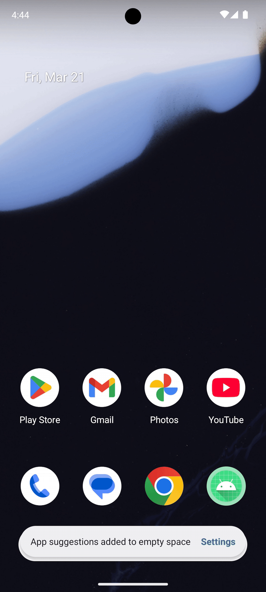
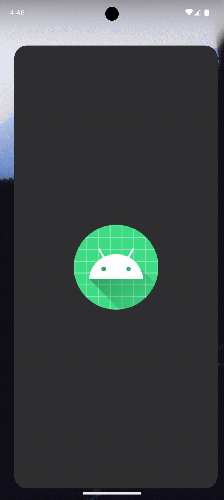
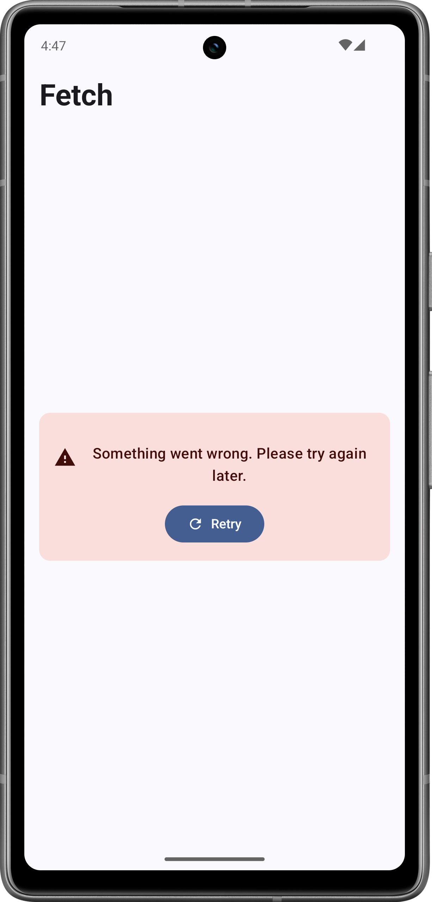
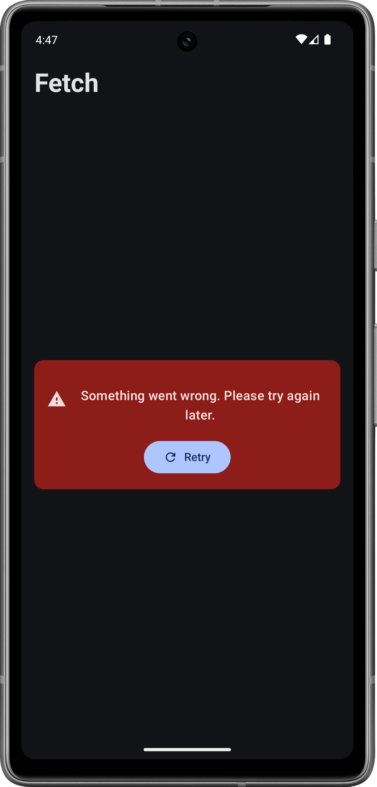

# Fetch Data Display App

Fetch is an Android application designed to retrieve, process, and present data from a remote JSON endpoint.

**Purpose:**

This application demonstrates the ability to:

* Perform asynchronous network requests to retrieve JSON data.
* Parse and deserialize JSON data into Kotlin data classes.
* Filter and group data based on `listId`.
* Display the processed data in an organized and user-friendly manner using an expandable list UI.

**Screenshots:**

| Light Mode           | Dark Mode            | Light Mode (Error) | Dark Mode (Error) |
| :-------------------- | :-------------------- | :------------------- | :------------------ |
|  |  |  |  |

This project follows the **MVVM (Model-View-ViewModel)** architectural pattern. This pattern was chosen to separate the UI and business logic, making the code more modular, testable and maintainable.

**Design Patterns:**

* **Repository Pattern:** Used to abstract data sources and provide a clean API for the ViewModel.
* **Dependency Injection:** Hilt is used to manage dependencies.

**Data Layer:**

* Data is fetched from `https://fetch-hiring.s3.amazonaws.com/hiring.json` using the Retrofit library.

**UI Layer:**

* The UI is built using Jetpack Compose, providing a declarative and modern approach to UI development.
* Also uses dynamic color for devices Android 12 and above.

## Libraries and Technologies

* **Jetpack Compose:** Modern UI toolkit.
* **Retrofit:** Networking library for API calls.
* **Retrofit GSON Converter:** Library for parsing Json response.
* **Hilt:** Dependency injection library.
* **Coroutines:** For asynchronous programming.
* **Material3:** For UI

## Setup and Installation

1.  Clone the repository: `git clone [[repository URL]](https://github.com/kailashchivhe/Fetch.git)`
2.  Open the project in Android Studio.
3.  Ensure you have the Android SDK (API level 34) installed.
4.  Build and run the app on an emulator or physical device `min API 29 i.e. Android 10`.

## Potential Improvements and Future Work

* Add Room DB for data caching.
* Add Hilt ViewModel DI.
* Improve the UI design with more animations and transitions.
* Add Unit and Instrumentation tests.
